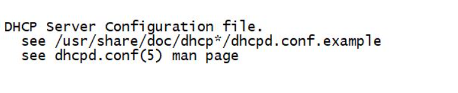
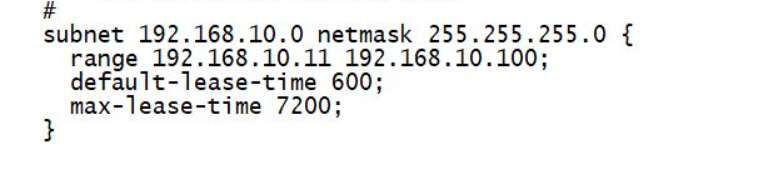

# What is DHCP?
The Dynamic Host Configuration Protocol (DHCP) is a network protocol that automatically assigns TCP/IP-related configuration to hosts in a network. Each host in a network connects to a centrally located DHCP server, which in turn provides the IP-related configuration of the host.This makes it easier for the administrator to manage the network.

DHCP server has the ability to assign more than 80 different network-related parameters to its client, if configured. But the most commonly used parameters are IP address, default gateway and IP address of DNS server.

The complete mechanism of assigning these parameters to the hosts takes place through a process called DORA process.

### Basic Information about DHCP
Configuration details for DHCP are provided below:

##### Package required for DHCP service to function is "dhcp".
##### By default DHCP service runs on the port 57.
##### The default Configuration file to modify DHCP service behaviour is /etc/dhcp/dhcpd.conf
##### The name of the Daemon/service is dhcpd in RHEL systems.

DORA Process - DHCP Discover - DHCP Offer - DHCP Request - DHCP Acknoledgment 
### Scenario:
Organization: Demagorg Limited
Employees: 100
Systems: Each employee has a dedicated system.
Objective: Enable internal communication between the machines.
Solution:

Manual Configuration vs DHCP:

Manually configuring IP addresses for 100 machines is impractical.
Mike, the system administrator, opts for a DHCP server for automatic IP configuration.
DHCP ensures no IP conflicts within the network.
DHCP Server Details:

Hostname: nameserver
IP Address: 192.168.1.254
Network Address: 192.168.1.0
DHCP Configuration Parameters (/etc/dhcp/dhcpd.conf):

Range: Valid range of IP addresses leaseable to client machines in the subnet.
Default-lease time: Default lease time if a client doesn't specify.
Max-lease-time: Maximum time a client can hold a leased IP.
Parameters Explanation:

Range: Defines the pool of IP addresses available for leasing.
Default-lease time: Time assigned to a client if it doesn't request a specific lease time.
Max-lease-time: Maximum lease duration; if a client asks for more, it gets this maximum.
Configuration File (/etc/dhcp/dhcpd.conf):

`subnet 192.168.1.0 netmask 255.255.255.0 {
    range 192.168.1.250 192.168.1.253; # Adjust the range as needed
    option domain-name-servers 192.168.1.254, 8.8.4.4; # DNS servers
    option routers 192.168.1.1; # Default gateway
    default-lease-time 10800; # 3 minutes
    max-lease-time 14400; # 4 hours
}`

### Explanation:
Defines a subnet with the given network address and netmask.
Specifies the range of IP addresses that can be leased to client machines.
Sets default lease time to 3 hours and max lease time to 4 hours.

# DHCP Configuration
### step 1: Installing dhcp package 
`yum install -y dhcpd` 
### step 2: Creating dhcp config file
Configuring a DHCP server involves a series of steps out of which, the first step is to create the configuration file. The configuration file created while installing the dhcp package is /etc/dhcp/dhcpd.conf, which is an empty file. This file is used to store network information about the client systems. This file can be configured by referring to the example file /usr/share/doc/dhcp-version;/dhcpd.conf.example. Suppose if the version of dhcp installed in the system is 4.2.5, the file name would be /usr/share/doc/dhcp-4.2.5/dhcpd.conf.example. Apart from /etc/dhcp/dhcpd.conf file, the DHCP server also uses  /var/lib/dhcpd/dhcpd.leases file to store lease information.

##### Observe the snapshot of the /etc/dhcp/dhcpd.conf file which is empty, below.

In order to configure the DHCP server to lease dynamic IP addresses to the client systems, few values in the configuration file have to be modified. Copy the following block of lines from the example configuration file /usr/share/doc/dhcp-4.2.5/dhcpd.conf.example and paste it in /etc/dhcp/dhcpd.conf.

In the configuration file, the corressponding subnet and netmask are mentioned, where the dhcpd should offer its services. Range mentions the start and end IP addresses which has to be leased to be client machines over the network. The default-lease time and max-lease-time are also set according to the requirement. Once the configuration changes are made, the confiugration file is saved. The dhcpd service is first enabled and then started using the following commands. 

`systemctl enable dhcpd` 

`systemctl start dhcpd`  OR `systemctl enable --now dhcp`

### Add the dhcp in the firewall 
`firewall-cmd --add-service=dhcp --permanent` 
`firewall-cmd --reload` 

### Restart dhcp 
`systemctl restart dhcp` 
