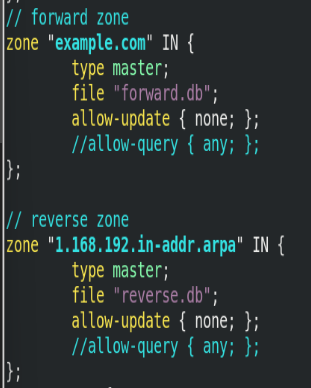
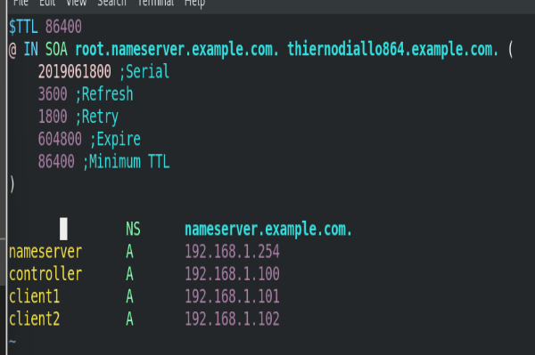
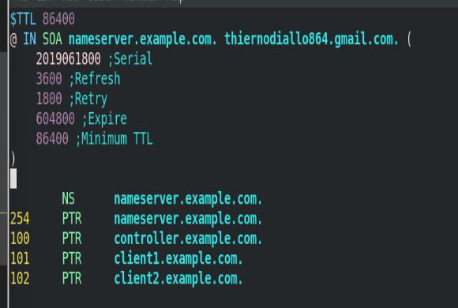

# How to confugure DNS
### 1. Install required packages:
`yum install bind bind-utils - y`
### 2. start and enable DNS daemon 
`systemctl enable --now named` 
### 3. Edit the named configuration file 
`vim /etc/named.conf` 
- from Top to Bottom inside options, edit the line `listen-on port 53 {127.0.0.1; 192.168.1.254} 
-  add the IP address of the server. in the above line, 192.168.1.254 is the IP address of the DNS server 

- Still, inside options, add the below lines:
forwarders {
    8.8.8.8;
    8.8.4.4.}     

- allow-query { any; };  OR allow-query { localhost; 192.168.1.0/24'; };
- That will allow connected clients to be able to connect to the outside world.

- Further down, configure the forward zone and the reverse zone sections, including their paths as you can see below.
- Use the following command to check the BIND configuration syntax:
  sudo named-checkconf /etc/named.conf

- Note the syntax and ensure to strictly follow it. Example.com is just an example domain. you will replace that by your domain name.
In the reverse zone, note how the internet address is written in reverse order appended to in-addr.arpa. Don't what that is, just right it like it is and find it out later if you are rabbit hole.
- Move inside the forward.db file inside /var/named
- If you have created or modified zone files, you should also check their syntax. You can use the named-checkzone utility for this purpose.
- sudo named-checkzone example.com /var/named/example.com.zone
- Modify it as in the below example.
nameserver is the dns, and the controller and client1 and client2 are the client machines using the dns server and their respective ip addresses.

- Then vim inside the reverse zone file inside /var/named and modify just like you can see below. 

NB: Do not forget to at dns service to firewall and reload it. 
Also, run the below command to allow named user to own config files to have full access to them. 
- chown named:named: /etc/named.conf
- chown named:named /var/named/forward.db  // 
- chown named:named /var/named/reverse.db 
### 4. Restart the named daemon and configure all the machines
 Ensure the dns server is the ip address of the confgured dns. and try to ping other other using their hostnames. Also use nslookup to check the reverse lookup.

 
